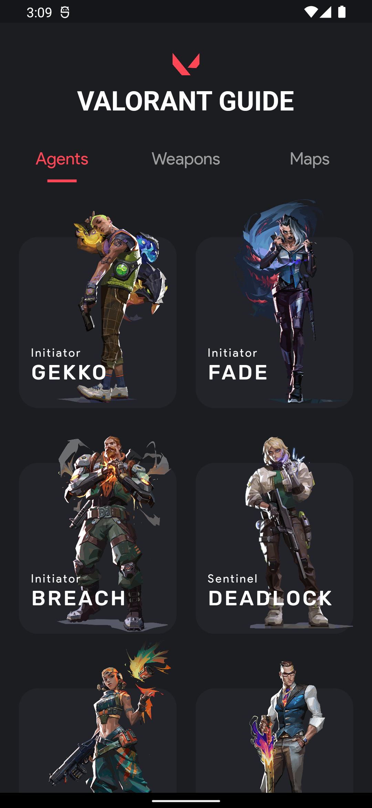
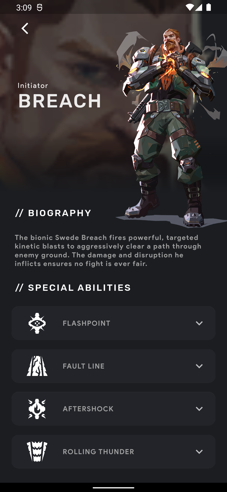
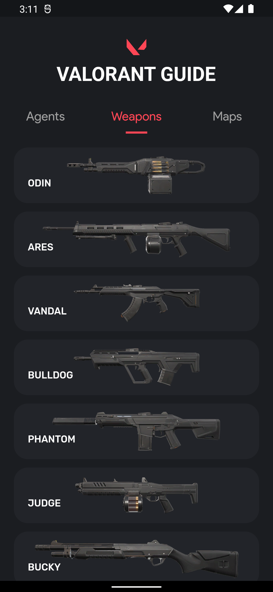
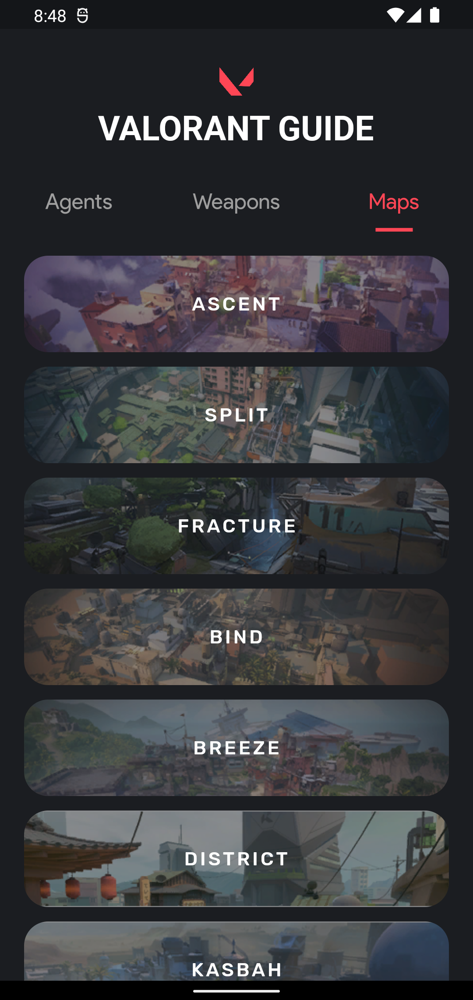

# 🔫 Valorant Game Guide
## Sobre o projeto

O Aplicativo consome a API [Valorant API
](https://valorant-api.com) e retorna uma lista de AGENTS, WEAPONS e MAPS com informações sobre eles.
 Seu layout é inspirado no design criado por [Malik Abimanyu](https://dribbble.com/shots/14073476-Valorant-Agents). 

## Layout 

  

### Tecnologias utilizadas

* Flutter
* Valorant API
* Bloc
* Dio
* Testes de unidade
* Cached Network Image

### Desenvolvedora

Jusy Lopes
https://www.linkedin.com/in/jusylopes
